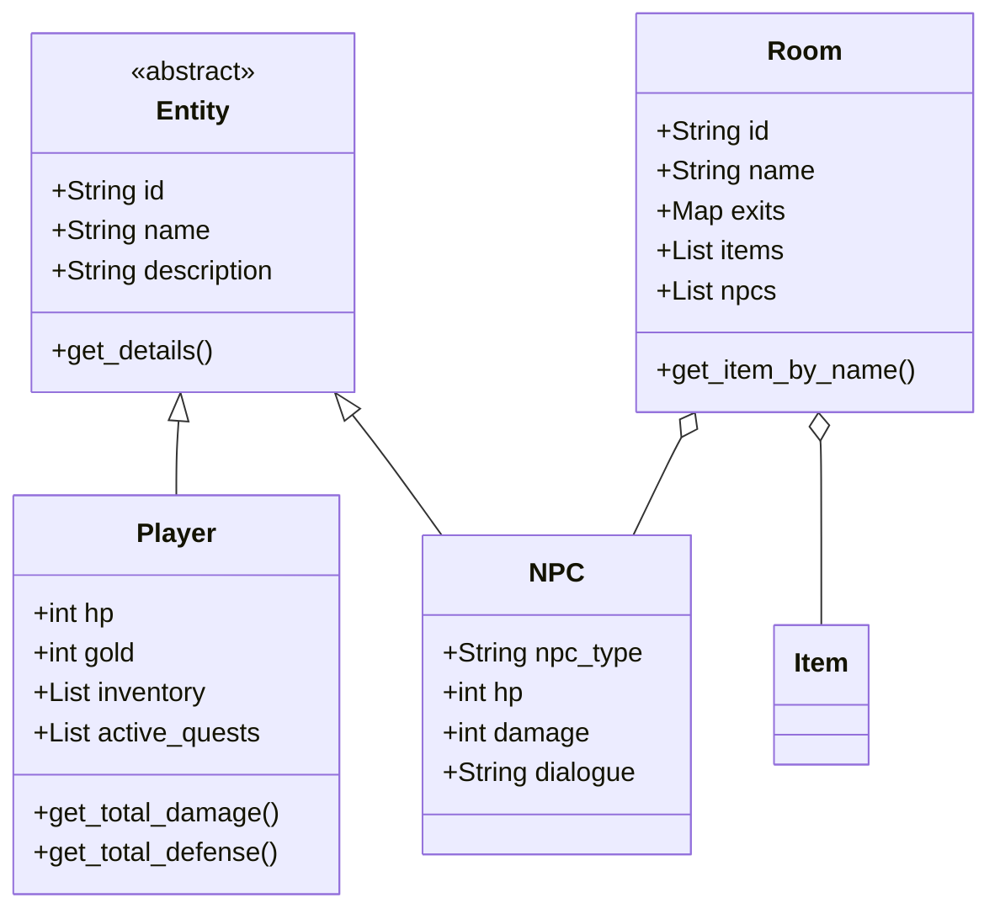
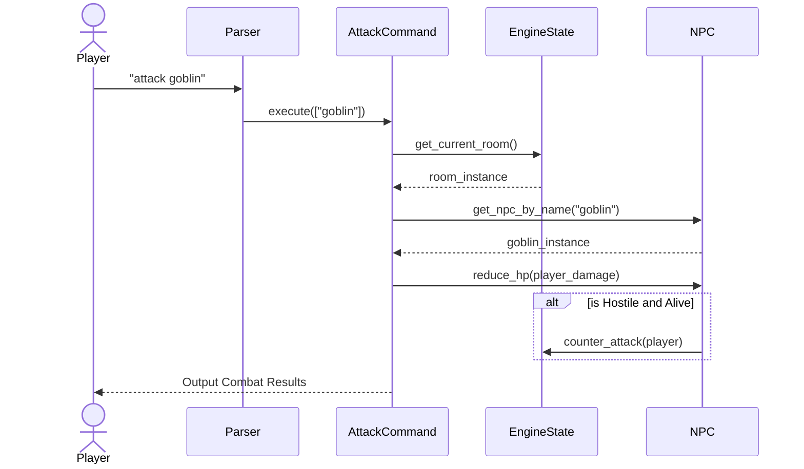
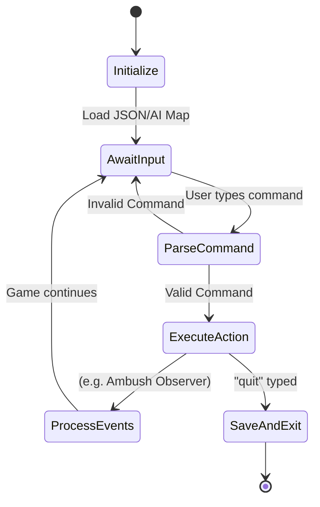

# Software Design Document (SDD)

## 1. Object-Oriented Foundations
The Adventure Engine is built upon core OOP principles:
- **Inheritance:** `Player` and `NPC` both inherit from a base `Entity` class, sharing core attributes like `id`, `name`, and `description`.
- **Aggregation:** A `Room` aggregates `Item` and `NPC` objects. When a room is destroyed or unloaded, the references to items within it are managed accordingly.
- **Encapsulation:** System states (like `player.hp` or `player.gold`) are modified through strict method calls (e.g., `player.take_damage(amount)`).
- **Polymorphism:** The `Command` abstract base class defines an `execute()` method. Each specific command (`GoCommand`, `AttackCommand`) overrides this to provide its own behavior.

## 2. Architecture Diagrams

### 2.1 Class Diagram (Core Entities)

### 2.2 Sequence Diagram (Command Execution: Attack)

### 2.3 State Machine Diagram (Game Loop)

## 3. Design Patterns

### 3.1 Command Pattern
All user inputs are handled via the Command Pattern. `engine/commands.py` contains classes like `TakeCommand` and `BuyCommand`. The `Parser` maps strings (e.g., "take") to the correct command instance, decoupling the input processing from the actual game logic.

### 3.2 Factory Pattern
During world generation (and the Editor), the JSON data is parsed by `GameState.load_from_dict()`. This acts as a Factory, instantiating raw dictionaries into concrete `Room`, `NPC`, and `Item` objects before the game starts.

### 3.3 Observer Pattern
The event system (implemented in `engine/core.py` and `engine/commands.py`) acts as an observer. For example, moving to a new room triggers a check for hostile NPCs. If an NPC with `npc_type == 'hostile'` is present, it automatically initiates an ambush sequence without explicit player prompt.
